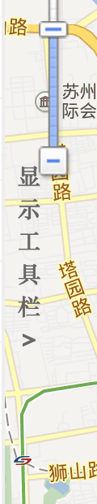
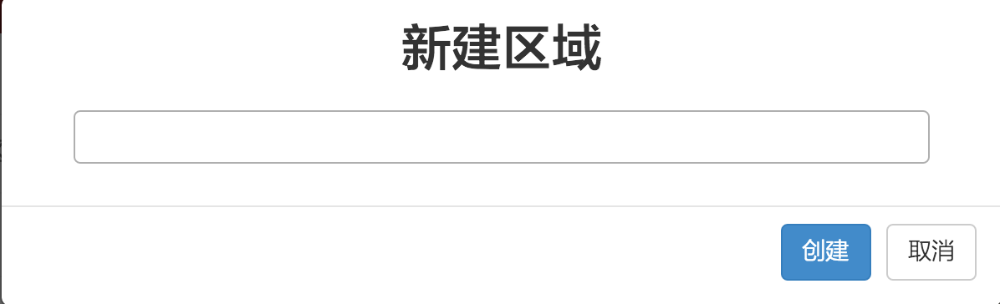
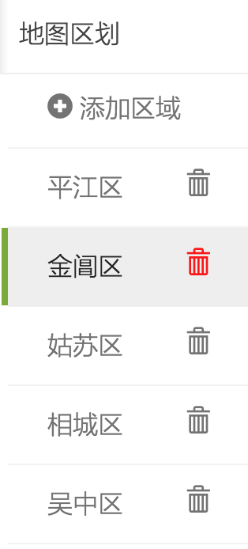
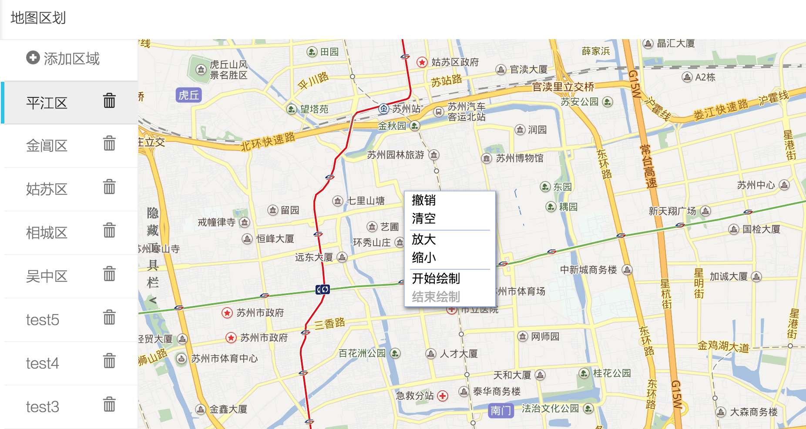

# regionDrawer-for-BaiduMap
## Read saved polyLine from database
if no region in database, there is tool bar on the left where you can create one.

To open the tool bar, click the label on the left of the map.

You can delete the whole region if don't needed

## In each Region:
There is a menulist when right click the map, there are functions like undo, clear, zoom in or out, start drawing and finish drawing. Once finish drawing, click on the map does not create new points.

